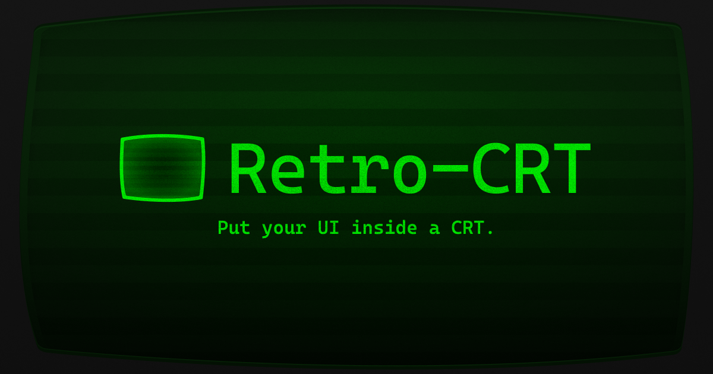

<p align="center">
  
</p>

<h1 align="center">retro-crt</h1>

<p align="center">
  A CRT monitor effect your content renders <em>inside</em>. Curvature, bloom and chromatic aberration
  apply to the real pixels of whatever you wrap, not a scanline sticker on top.
</p>

<p align="center">
  <a href="https://www.npmjs.com/package/retro-crt"></a>
  
  
</p>

---

## Install

```bash
npm install retro-crt                      # plain JS
npm install retro-crt @retro-crt/react     # or /vue, /svelte, /solid, /angular
```

## Use it

```js
import { CRT } from 'retro-crt'
import 'retro-crt/styles.css'

const screen = CRT.mount('#app', { curvature: 0.4 })

screen.update({ curvature: 0.7 })
screen.activeRenderer // 'webgl' | 'svg' | 'css'
screen.destroy()
```

```jsx
import { CRTScreen } from '@retro-crt/react'
import 'retro-crt/styles.css'

<CRTScreen curvature={0.4} scanlines={{ intensity: 0.6 }}>
  <App />
</CRTScreen>
```

Every adapter takes the same plain `CRTOptions` object, so a config you tune on the site drops into
any framework unchanged. All adapters are SSR-safe. The effect starts after mount.

To wrap a whole page, call `CRT.mountFullPage()` instead of `CRT.mount()`.

> [!WARNING]
> Wrapping content breaks `position: fixed` inside it. A CSS filter makes its element the containing
> block for every fixed and absolute descendant, so modals, sticky headers and dropdowns inside the
> screen anchor to the wrapper instead of the viewport. `CRT.mountFullPage()` avoids this, because the
> spec exempts the root element. In development the library names any fixed descendants it finds.

## Renderers

Three tiers. `renderer: 'auto'` picks one from measured facts, never the user-agent string.

| | `webgl` | `svg` | `css` |
|---|---|---|---|
| How | fragment shader over a texture | SVG filters on the DOM | gradients, blend modes, backdrop blur |
| Curvature | true barrel | approximation | edge shading |
| Bloom | yes | yes | approximate |
| Chromatic aberration | yes | yes | no |
| Persistence | yes | no | no |
| Content stays interactive | **no** | yes | yes |
| Picked for | a lone ``, `<video>` or `<canvas>` | Chrome and Firefox on desktop | Safari over animating content, low-end devices, Save-Data |

Auto runs a filtered-SVG readback probe, checks for the WebKit compositor bug that silently drops
`url(#…)` filters, probes WebGL with a real shader compile, reads the device class, then samples
frame times for two seconds. If the budget slips it steps quality down first and only then drops a
tier. Downgrades never reverse, so the renderer cannot oscillate. The WebGL tier is a separate chunk
that loads only when something uses it.

## Options

```ts
interface CRTOptions {
  renderer?: 'auto' | 'webgl' | 'svg' | 'css'        // 'auto'
  background?: string                                // '#000000'
  curvature?: number                                 // 0-1, 0.3
  vignette?: number                                  // 0-1, 0.5
  scanlines?: { intensity?: number; gap?: number; flicker?: boolean }   // 0.5, 3px, false
  tint?: { preset?: 'default' | 'green' | 'amber' | 'blue' | 'violet' | 'lime' | 'pink' | 'red'
           strength?: number }                       // 'default', 0.35
  bloom?: { enabled?: boolean; radius?: number; strength?: number; threshold?: number }
  chromaticAberration?: { intensity?: number }       // 0-6px, 0.6
  noise?: { enabled?: boolean; static?: number }     // true, 0.04
  persistence?: { strength?: number }                // 0-0.5, 0 (webgl only)
  bezel?: { enabled?: boolean; thickness?: number; radius?: { outer?: number; screen?: number }
            color?: string; bevel?: number; lightAngle?: number; innerLip?: number
            screenSpill?: number; glare?: number; shadow?: boolean }
  quality?: 'auto' | 'high' | 'balanced' | 'low'     // 'auto'
  maxPixelRatio?: number                             // 2
  pauseWhenOffscreen?: boolean                       // true
  respectReducedMotion?: boolean                     // true
  respectSaveData?: boolean                          // true
}
```

Out-of-range numbers clamp. Unknown values fall back to the default. `background` and `bezel.color`
accept `#rgb`, `#rrggbb` and `rgb()` only, so no caller string reaches a CSS custom property intact.
When a renderer cannot honour an option you set, it ignores it and warns once in development.
The bezel is off by default and costs nothing while it is off.

## Limits worth knowing

- SVG curvature uses `feDisplacementMap`, so it approximates. WebGL does true per-pixel barrel.
- SVG filters rasterise text, which softens body copy at high curvature. The CSS tier does not.
- Persistence needs frame history, so it is WebGL only.
- `mountFullPage()` ignores curvature. The root element spans the document, not the viewport.
- Scanlines and tint cut contrast. Re-check WCAG at the settings you ship.
- `prefers-reduced-motion` stops flicker, grain and persistence. `prefers-reduced-transparency`
  halves tint and bloom. Save-Data forces the CSS tier. Effect layers are `aria-hidden` and
  `pointer-events: none`.

## The site

`apps/site` is a Next.js app with two modes.

- `/` tunes the effect over live previews and exports a drop-in snippet for React, Javascript,
  Typescript, HTML, Vue, Svelte, Solid or Angular.
- `/image` applies the effect to your own image or video and downloads the result.

Everything runs in the tab. There is no backend and no upload. Files are checked by extension, MIME
type, magic bytes, size, duration and header dimensions before anything decodes, and SVG is rejected
in every disguise.

## Develop

```bash
npm install
npm run dev          # builds the packages, starts the site on :3000
npm run build        # core, then every adapter
npm test             # unit tests
npm run size         # bundle budgets
```

```
packages/core                             retro-crt, zero runtime dependencies
packages/react|vue|svelte|solid|angular   thin lifecycle adapters
apps/site                                 the Next.js site
```

## Deploy

The site deploys to Vercel with **Root Directory** set to `apps/site`. `vercel.json` builds the
workspace packages first. Open Graph URLs resolve from Vercel's own domain variable, so a fresh
deploy needs no configuration. Set `NEXT_PUBLIC_SITE_URL` once you point a custom domain at it.

## Release

```bash
npm login
npm run release      # builds, then publishes retro-crt and every adapter
```

## License

MIT
